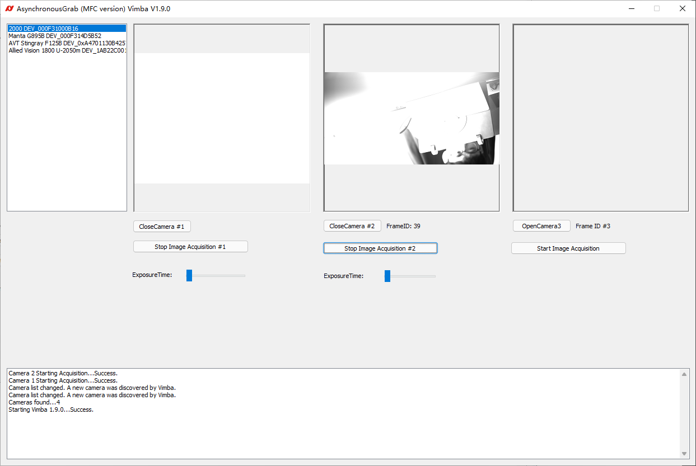

# mfc_multiple_cameras - Vimba CPP Multiple Cameras Example
Vimba C++ AsynchronousGrab MFC example with multiple cameras supported.

## Instruction
Remember copy `\Vimba2.1\VimbaCPP\Bin\Win[32|64]\*.dll` files to `\Build\VS2010\Win32\Debug\` folder:  
* VimbaC.dll  
* VimbaCPP.dll  
* VimbaCPPd.dll
* VimbaImageTransform.dll

## Screenshot

## Comments
如果多个相机通过交换机接入电脑的千兆网口，一定要注意此时多台相机的数据是共享一条千兆网的，为避免不稳定，需要合理分配每个相机的带宽；
对于独立网口连接不同的相机，则不存在此问题。
